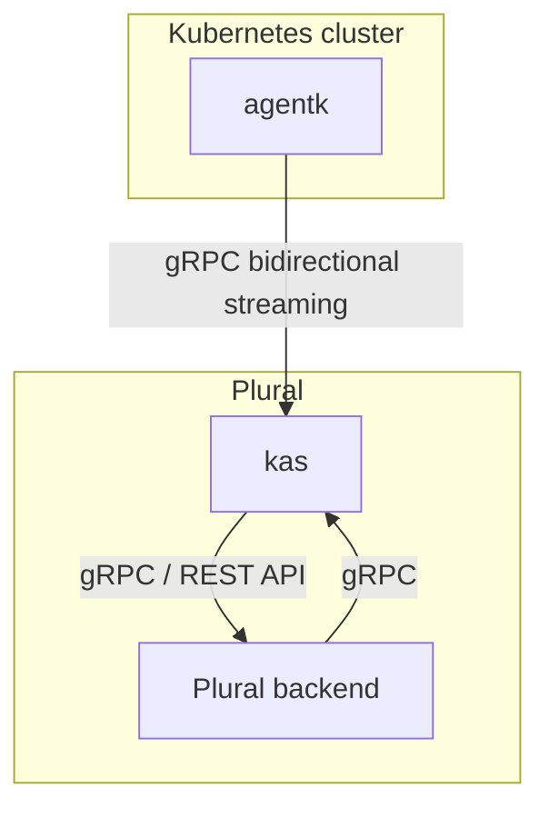

# Agent architecture

## Issues the agent is trying to address

- Integrate a cluster, located behind a firewall or NAT, with Plural. The agent keeps a long-lived reverse tunnel so Plural can reach cluster services without opening inbound network access.
- Access API endpoints in a cluster in real time. For example, powering dashboards or on-demand operations against in-cluster services.
- Enable real-time features by pushing information about events happening in a cluster.
  For example, you could build a cluster view dashboard to visualize changes in progress
  in a cluster.
- Enable a [cache of Kubernetes objects through informers](https://github.com/kubernetes/client-go/blob/ccd5becdffb7fd8006e31341baaaacd14db2dcb7/tools/cache/shared_informer.go#L34-L183),
  kept up-to-date with very low latency. This cache helps you:

  - Reduce or eliminate information propagation latency by avoiding Kubernetes API calls
    and polling, and only fetching data from an up-to-date cache.
  - Lower the load placed on the Kubernetes API by removing polling.
  - Eliminate any rate-limiting errors by removing polling.
  - Simplify backend code by replacing polling code with cache access. While it's another
    API call, no polling is needed.

## High-level architecture

The Plural Agent and the Plural Agent Server use
[bidirectional streaming](https://grpc.io/docs/what-is-grpc/core-concepts/#bidirectional-streaming-rpc)
to allow the connection acceptor (the gRPC server, Plural Agent Server) to
act as a client. The connection acceptor sends requests as gRPC replies. The client-server
relationship is inverted because the connection must be initiated from inside the
Kubernetes cluster to bypass any firewall or NAT the cluster may be located behind.

This diagram describes how Plural (the main Plural application), the Plural Agent (`agentk`),
and the Plural Agent Server (`kas`) work together.

- `Plural backend` is the main Plural application and related services. It uses gRPC/HTTP to talk to `kas`.
- `agentk` is the Plural Agent. It keeps a connection established to a
  `kas` instance, waiting for requests to process. It may also actively send information
  about things happening in the cluster.
- `kas` is the Plural Agent Server, and is responsible for:
  - Accepting requests from `agentk`.
  - Authentication and authorization of requests from `agentk` by querying Plural backend services.
  - Fetching agent configuration from a corresponding Git repository by querying repository storage (for example, via Gitaly-compatible APIs).
  - Matching incoming requests from Plural backend with existing connections from
    the right `agentk`, forwarding requests to it and forwarding responses back.
  - (Optional) Sending notifications for events received from `agentk`.
  - Polling manifest repositories for GitOps-style support by communicating with repository storage.

For an overview of how the repository is structured, see [Repository overview](developing.md).

Plural prefers to add logic into `kas` rather than `agentk`. `agentk` should be kept
streamlined and small to minimize the need for upgrades. In hosted Plural environments,
`kas` is managed by Plural, so upgrades and features can be added without requiring you
to upgrade `agentk` in your clusters.

`agentk` can't be viewed as a dumb reverse proxy because features are built
on top of the cache with informers.

### Backend-for-frontend API module

On top of `kas`, Plural provides a dedicated API service (the `api` module in this repository)
which acts as a backend-for-frontend for Kubernetes features. This service:

- Connects to `kas` using the same APIs described above.
- Provides a stable, frontend-oriented API surface for Plural UIs.
- Hides details of agent routing, tunneling, and caching from the UI layer.

The `api` module is deployed alongside the Plural backend and talks to `kas` the same way
other backend components do, but with a contract oriented around UI use cases
(listing resources, fetching details, driving dashboards, triggering operations, and so on).

See [doc/modules.md](modules.md) for more details about the individual modules.
