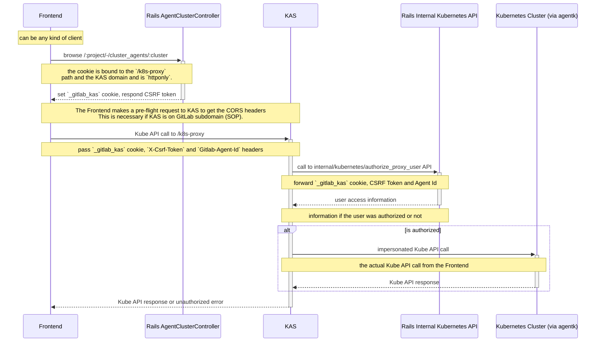

# Access to Kubernetes using GitLab user credentials

## Problem to solve

Issue: <https://gitlab.com/gitlab-org/gitlab/-/issues/331431>

- As a user of a Kubernetes cluster that is connected to GitLab using the GitLab
  agent, I would like to interact directly with the cluster using the Kubernetes
  API.
- As a Platform Engineer, I would like to manage access to the cluster using GitLab
  user membership.

## Personas

- [Delaney (Development Team Lead)](https://about.gitlab.com/handbook/marketing/product-marketing/roles-personas/#delaney-development-team-lead)
- [Sasha (Software Developer)](https://about.gitlab.com/handbook/marketing/product-marketing/roles-personas/#sasha-software-developer)
- [Priyanka (Platform Engineer)](https://about.gitlab.com/handbook/marketing/product-marketing/roles-personas/#priyanka-platform-engineer)
- [Allison (Application Ops)](https://about.gitlab.com/handbook/marketing/product-marketing/roles-personas/#allison-application-ops)
- [Ingrid (Infrastructure Operator)](https://about.gitlab.com/handbook/product/personas/#ingrid-infrastructure-operator)

## User experience goal

- An agent administrator can grant GitLab users access to a Kubernetes cluster
  that is connected via the GitLab agent. The agent administrator can then:
  - Manage the _level_ of access using [Kubernetes
    RBAC](https://kubernetes.io/docs/reference/access-authn-authz/rbac/).
  - Have an overview of active [sessions](#authentication).
  - Unilaterally revoke individual sessions.
- A user with access can connect to a cluster using their GitLab identity.

## Proposal

### Agent admin side

In the agent's configuration file, managed in code in the agent's configuration project,
the user configures a `user_access` object. The following keys are available:

- `projects`: A list of projects whose members should have access.
- `groups`: A list of groups whose members should have access.
- `access_as`: Required. Can have one of two values:
  - `{ agent: {} }`: Connect using the [agent's service account](#plain-access).
  - `{ user: {} }`: **(PREMIUM)** [Impersonate the authenticated user](#user-impersonation-premium)

For example:

```yaml
# .gitlab/agents/my-agent/config.yaml

user_access:
  access_as:
    user: {}
  projects:
    - id: group-1/project-1
    - id: group-2/project-2
  groups:
    - id: group-2
    - id: group-3/subgroup
```

### Authorized user side

Authorized users should be granted API access to the Kubernetes API in a
[variety of ways](#authentication), using their [GitLab identity when
interacting with the API](#user-impersonation).

This functionality is exposed the user as follows:

1. Under the user's personal preferences, there is a `Kubernetes` page listing
   the agents shared directly with them.
1. When a user visits a group's or project's `Infrastructure > Kubernetes` page,
   they see agents shared with them via that project or group. For each such
   agent, there should be an option to connect to the agent..

Only **developers** and above can connect to an agent with `user_access`.

## Implementation

We extend the [existing API proxy endpoint](kubernetes_ci_access.md) with new
functionality.

### Authentication

Any member specified in the configuration should be able to access the
Kubernetes API of the cluster using any of the following authentication methods:

- [Personal Access Token](#personal-access-token)
- [OpenID Connect (OIDC)](#openid-connect-oidc)
- [Browser cookie on GitLab frontend](#browser-cookie-on-gitlab-frontend)

KAS can be distinguish between the methods as follows:

- The personal access tokens is a bearer token with the format `pat:<agent ID>:<token>`.
- The OIDC ID token, also a bearer token, is a signed, unencrypted JWT.
- The browser cookie goes in a separate`Cookie` header. Combining
  `Authentication` and `Cookie` headers is not allowed.

#### Personal Access Token

A prefixed personal access token of the form `pat:<agent_id>:<token>` as a
bearer token, where:

- `<agent_id>` is the numeric agent ID.
- `<token>` is the personal access token.

The personal access token:

- Must have the new scope `k8s_proxy`.
- Should not have any other scope. In other words, the token should not grant
  access to any other GitLab API.
- Should expire in a year or sooner.

When selecting the `k8s_proxy` scope, a mandatory association must be made to
exactly one agent (similar to [this issue for
projects](https://gitlab.com/gitlab-org/gitlab/-/issues/22114)).

This association can be implemented with a join table between `cluster_agents`
and `personal_access_tokens`, with a unique constraint on
`personal_access_token_id`. Deletes on `personal_access_tokens` should cascade
to the join table.

**Example request:**

```shell
curl "https://kas.gitlab.example.com/k8s-proxy/version" \
    --header "Authorization: Bearer <personal access token>"
```

#### OpenID Connect (OIDC)

An OIDC-compliant ID issued by GitLab, where KAS behaves as if it were a
[OIDC-enabled Kubernetes API
server](https://kubernetes.io/docs/reference/access-authn-authz/authentication/#openid-connect-tokens)
with the following parameters:

- `--oidc-issuer-url`: `https://gitlab.example.com`, i.e. the GitLab URL
- `--oidc-client-id`: The client ID of the [OAuth 2.0 application](https://docs.gitlab.com/ee/integration/oauth_provider.html).

OAuth 2.0 applications wishing to access clusters via KAS must have the scopes:

- `openid` to identify them as an OIDC application
- `k8s_proxy` for access to the API proxy

Additional scopes are allowed, but not recommended without a strong use case. (An
example of such a use case might be a developer tool that pushes an image to the
registry and deploys it to the cluster.)

To target an individual agent during authorization (`/oauth/authorize`), an
application may use the [resource
indicator](https://datatracker.ietf.org/doc/html/rfc8707)
`clusters/agents/k8s-proxy:<agent_id>` ([needs upstream
work](https://github.com/doorkeeper-gem/doorkeeper/issues/1413)).

During the OAuth 2.0 authorization flow, the user selects _exactly one agent_ to
access (similar to [the proposal in this
issue](https://gitlab.com/gitlab-org/gitlab/-/issues/22115)). The resulting ID
token _must_ include the following claim:

```json
"https://gitlab.org/claims/clusters/agents/k8s-proxy": <agent_id>
```

If this claim is not present, then KAS/GitLab must not grant access to any
agent, regardless of whether the scope `k8s_proxy` is present in the token.

This association can be implemented with a join table between `cluster_agents`
and `oauth_access_tokens`, with a unique constraint on `oauth_access_token_id`.
Deletes on `oauth_access_tokens` should cascade to the join table.

**Example request:**

The OIDC ID token is sent as a bearer token for authentication:

```shell
curl "https://kas.gitlab.example.com/k8s-proxy/version" \
    --header "Authorization: Bearer <ID token>"
```

**Example kubeconfig:**

```yaml
apiVersion: v1
kind: Config
clusters:
  - name: gitlab
    cluster:
      server: "https://kas.gitlab.example.com/k8s-proxy/"
users:
  - name: agent:<agent ID>
    user:
      auth-provider:
        name: oidc
        config:
          idp-issuer-url: "https://gitlab.example.com/"
          client-id: <OpenID application client ID>
          refresh-token: <OIDC refresh token>
          id-token: <OIDC ID token JWT>
contexts:
  - name: example-user
    context:
      cluster: gitlab
      user: agent:<agent ID>
```

###### OIDC as an alternative to PATs

As an alternative to Personal Access Tokens, GitLab could come with a special
predefined OAuth 2.0 application, under which it issues OIDC tokens for user
access from the GitLab UI.

Such a predefined GitLab KAS OAuth 2.0 application:

- Should only have the scopes `openid` and `k8s_proxy`.
- Should allow the token to be refreshed without a client secret, because it
  will be refreshed by desktop clients such as `kubectl`.
  - In GitLab, this requires the application to be marked as non-confidential,
    but the client secret should still be kept secret.
- May skip implementing the standard `/oauth/authorize` flow, because the tokens
  would be issued from a context where the user is already authorized.
- If the full `/oauth/authorize` flow is implemented, then the `redirect_uri`
  should be to a page on GitLab (as opposed to, for example, a local web
  server or a deep link).

**Regardless of whether OIDC or PATs are used, the [authorized user
experience](#authorized-user-side) should remain the same.**

#### Browser cookie on GitLab frontend

A cookie `_gitlab_kas` similar to the `_gitlab_session` cookie, but
specific to KAS and available on the KAS subdomain.

- The agent, in this case, is selected using a header `Gitlab-Agent-Id`
  containing the numeric agent ID.
- A form of [CSRF-protection](https://cheatsheetseries.owasp.org/cheatsheets/Cross-Site_Request_Forgery_Prevention_Cheat_Sheet.html). For example, a header `X-CSRF-Token` that KAS forwards along with the `_gitlab_kas` to the GitLab backend.

**Example request:**

```shell
curl "https://kas.gitlab.example.com/k8s-proxy/version" \
    --cookie "_gitlab_kas=<cookie value>"  \
    --header "Gitlab-Agent-Id: <agent id>" \
    --header "X-Csrf-Token: <csrf token>"
```

Or from within a browser console (make sure to use the correct `Gitlab-Agent-Id`):

```js
fetch("https://kas.gitlab.example.com/k8s-proxy/version", {
  credentials: "include",
  headers: {
    "X-Csrf-Token": document.head.querySelector('meta[name="csrf-token"]')
      .content,
    "Gitlab-Agent-Id": "1",
  },
})
  .then((response) => response.json())
  .then((data) => console.log(data));
```

### Authorization

#### `POST /api/v4/internal/kubernetes/authorize_proxy_user`

The user calls KAS with one of the above credentials. KAS then calls a GitLab
endpoint `POST /api/v4/internal/kubernetes/authorize_proxy_user` with the
provided user credentials and agent ID:

```javascript
{
    "agent_id": <agent_id>, // in case of OIDC, extracted from the ID token JWT
    "access_type": "personal_access_token" | "oidc_id_token" | "session_cookie",
    "access_key": "<the token or cookie>"
    "csrf_token": "<from the X-Csrf-Token header>" // for verification
}
```

GitLab resolves the credentials to a user, and, on success, responds back with
user's identity, and list of details about the access type and matching entries
in `user_access`.

When responding to the request:

1. Resolve the user. If the access key is invalid, return `401 Unauthorized`
   with a body `Invalid user access key` (the body helps KAS differentiate
   between that and invalid KAS <-> GitLab secret). KAS should return `401
Unauthorized` to the user.
1. Loop through `user_access.projects` and `user_access.groups`. If the user is
   not at least a **developer** in at least one group or project, return `403
Forbidden`. KAS should return `401 Unauthorized` to the user, identical to
   the one above to prevent database enumeration of agent IDs.
1. Then, when

   - `access_as.agent`: No further processing is required. Return `200 Success`.
   - `access_as.user`: The `authorize_proxy_user` endpoint **must** only return
     information about `projects` and `groups` where the user is at least a
     `developer`. If the list of such authorizations is empty, then

   See [response examples](#response-examples) for details on the response
   structure.

Once KAS has authenticated and authorized the request, the request gets
forwarded to agentk. The format depends on the value of `user_access.access_as`
in the agent's configuration file:

- `{ agent: {...} }`: The request gets [made using the agent's service account](#plain-access).
- `{ user: {...} }`: The agent [impersonates the authenticated user](#user-impersonation-premium).

##### Response examples

`access_as.agent` response:

```javascript
// HTTP/1.1 200 OK
// Content-Type: application/json
{
    "agent": {
        "id": 9999,
        "config_project": {
          "id": 1234
        }
    },
    "user": { // the user requesting access
        "id": 1234,
        "username": "the-user"
    },
    "access_as": {
        "agent": {}
    }
}
```

`access_as.user` response:

```javascript
// HTTP/1.1 200 OK
// Content-Type: application/json
{
    "agent": {
        "id": 9999,
        "config_project": {
            "id": 1234
        }
    },
    "user": { // the user requesting access
        "id": 1234,
        "username": "the-user"
    },
    "access_as": {
        "user": {
            // **ONLY** projects where the user is a developer or above
            "projects": [
                {
                    "id": "group-1/project-1",
                    "roles": [ "reporter", "developer", "maintainer" ]
                }
            ],
            // **ONLY** groups where the user is a developer or above
            "groups": [
                {
                    "id": "group-2",
                    "roles": [ "reporter", "developer" ]
                }
            ]
        }
    }
}
```

Simplified protobuf schema for response:

```protobuf
message AuthorizeProxyUserResponse {
  Agent agent = 1;
  User user = 2;
  AccessAs access_as = 3;
}

message Agent {
  int64 id = 1;
  ConfigProject config_project = 2;
}

message User {
  int64 id = 1;
  string username = 2;
}

message ConfigProject {
  int64 id = 1;
}

message ProxyAuthorization {
  oneof authorization {
    AccessAsAgentAuthorization agent = 1;
    AccessAsUserAuthorization user = 2;
  }
}

message AccessAsAgentAuthorization {}

message AccessAsUserAuthorization {
  repeated AccessCF projects = 1;
  repeated AccessCF groups = 2;
}

message AccessCF {
  string id = 1;
  repeated string roles = 2;
}
```

#### Plain access

When `user_access.access_as` has the value `{ agent: {...} }`, requests is
forwarded to the API server using the agent's service account.

#### User impersonation **(PREMIUM)**

When `user_access.access_as` is `{ user: {...} }`, the request should be
transformed into an impersonation request for the authenticated user, where
agentk impersonates _all_ of the `access_as` present, as follows:

- `UserName` is set to `gitlab:user:<username>`
- `Groups` is set to:
  - `gitlab:user`: Common to all requests coming from GitLab users.
  - `gitlab:project_role:<project_id>:<role>` for each role in each authorized project.
  - `gitlab:group_role:<group_id>:<role>` for each role in each authorized group.
- `Extra` carries extra information about the request:
  - `agent.gitlab.com/id`: The agent id.
  - `agent.gitlab.com/username`: The username of the GitLab user.
  - `agent.gitlab.com/config_project_id`: The agent configuration project id.
  - `agent.gitlab.com/access_type`: One of `personal_access_token`,
    `oidc_id_token`, `session_cookie`

**Important:** Only projects and groups directly listed in the under
`user_access` in the configuration file get impersonated. For example,
if we have:

```yaml
# .gitlab/agents/my-agent/config.yaml

user_access:
  projects:
    - id: group-1/project-1 # group_id=1, project_id=1
    - id: group-2/project-2 # group_id=2, project_id=2
  groups:
    - id: group-2 # group_id=2
    - id: group-3/subgroup # group_id=3, group_id=4
```

Then:

- If a user is only a member of `group-1`, they would _only_ receive
  the Kubernetes RBAC groups `gitlab:project_role:1:<role>`.
- On the other hand, members of `group-2`, would receive both of the following
  Kubernetes RBAC groups:
  - `gitlab:project_role:2:<role>`,
  - `gitlab:group_role:2:<role>`.

#### Full Proxy Flow from Frontend to Cluster using the KAS Cookie

The following sequence diagram depicts a Kube API proxy call initiated
by the _Frontend_ via KAS and agentk authorized by Rails using the GitLab
user information.

This involves:

- [Browser cookie on GitLab frontend](#browser-cookie-on-gitlab-frontend)
- [Authorization via `POST /api/v4/internal/kubernetes/authorize_proxy_user`](#post-apiv4internalkubernetesauthorize_proxy_user)



### Default configuration

- Token-based access must always be explicitly configured.
- Consider allowing cookie-based access on GitLab frontend implicitly based on
  other configuration such as `ci_access` and `gitops`.

### Notifying GitLab of agent's configuration

Re-uses the [existing mechanism](kubernetes_ci_access.md#notifying-gitlab-of-agents-configuration).

### Request proxying flow

1. KAS gets a request from the user with one of the [authentication methods](#authentication)
   - In the absence of an authentication method, the request is rejected with HTTP code 401
   - If the authentication information is incomplete or malformed, the request is rejected with HTTP code 400.
1. KAS makes a request to
   [`/api/v4/internal/kubernetes/authorize_proxy_user`](#post-apiv4internalkubernetesauthorize_proxy_user)
   to receive information about the user in the context of the agent.
   - The endpoint rejects the request with 401/403/404 as appropriate (being
     mindful of enumeration attacks).
   - On 200, KAS can assume the user has at least one "authorization path" to
     the agent
1. KAS proxies the request to agentk, enriching it with information from the
   authorization response
1. Agentk proxies the request to Kubernetes, applying the appropriate
   impersonation configuration

### Audit events

Certain activity should generate [audit
events](https://docs.gitlab.com/ee/administration/audit_events.html):

- Creation, revocation and deletion of user-access tokens associated with an
  agent (OAuth or PAT).
- All user access to the cluster via the agent, up-to a reasonable time
  resolution: These are high volume events (`kubectl` is chatty), so it may be
  necessary to limit logging to one entry per `time bucket`, possibly with a
  counter.

Both the user and the agent admin should have access to such logs.

Work on audit events for the agent is being tracked in [this
issue](https://gitlab.com/gitlab-org/cluster-integration/gitlab-agent/-/issues/266).

## References

### GitLab links

#### Docs

- [OAuth provider](https://docs.gitlab.com/ee/integration/oauth_provider.html)
- [OIDC provider](https://docs.gitlab.com/ee/integration/openid_connect_provider.html)
- [OAuth 2.0 API](https://docs.gitlab.com/ee/api/oauth2.html)
  - [PKCE](https://docs.gitlab.com/ee/api/oauth2.html#authorization-code-with-proof-key-for-code-exchange-pkce)
- [Credentials inventory](https://docs.gitlab.com/ee/user/admin_area/credentials_inventory.html#credentials-inventory) -- similar concept to agent token listing.

#### Issues & Epics

- Role / resource scoped access tokens have been a long-standing request:
  - <https://gitlab.com/gitlab-org/gitlab/-/issues/31619>
  - <https://gitlab.com/gitlab-org/gitlab/-/issues/22114>
  - <https://gitlab.com/gitlab-org/gitlab/-/issues/22115>
  - <https://gitlab.com/gitlab-org/gitlab/-/issues/19090>
  - <https://gitlab.com/gitlab-org/gitlab/-/issues/297536>
  - <https://gitlab.com/gitlab-org/gitlab/-/issues/297537>
- [RBAC pilot epic](https://gitlab.com/groups/gitlab-org/-/epics/7420)
- [Doorkeeper pull request](https://github.com/doorkeeper-gem/doorkeeper/pull/1559) to add resource scopes. Doorkeeper is what GitLab uses for OAuth 2.0 and OIDC.

### OIDC specs and RFCs

- [OIDC 1.0](https://openid.net/specs/openid-connect-core-1_0.html)
- [Resource indicators for OAuth 2.0](https://datatracker.ietf.org/doc/html/rfc8707)
- [JWT RFC](https://datatracker.ietf.org/doc/html/rfc7519)
- [OAuth 2.0 Rich Authorization Requests - Draft RFC](https://datatracker.ietf.org/doc/html/draft-ietf-oauth-rar)
  - Most useful when combined with [Pushed Authorization Requests](https://datatracker.ietf.org/doc/html/rfc9126), which seems overkill for our purposes.
- [OAuth 2.1 - draft RFC](https://datatracker.ietf.org/doc/html/draft-ietf-oauth-v2-1-05)
