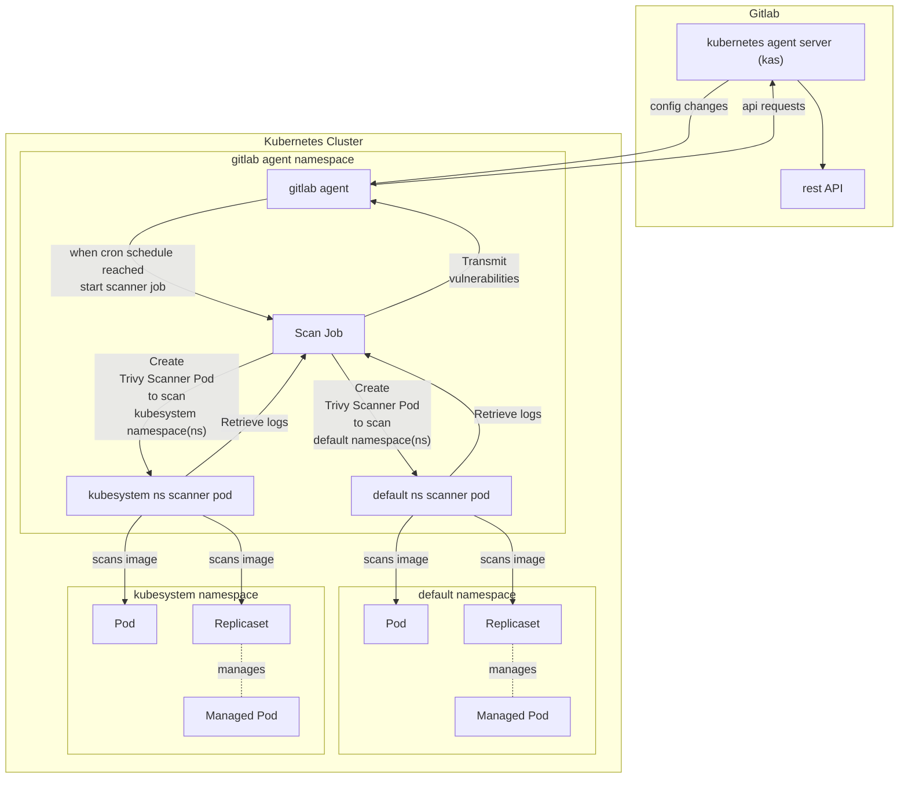

# Operational Container Scanning

## Essential readings
- [Operational container scanning](https://docs.gitlab.com/ee/user/clusters/agent/vulnerabilities.html) docs
- gitlab-agent [high-level-architecture](https://gitlab.com/gitlab-org/cluster-integration/gitlab-agent/-/blob/master/doc/architecture.md#high-level-architecture)
- [developing](./developing.md)

## Running OCS locally
- OCS code resides in [starboard_vulnerability](../internal/module/starboard_vulnerability/)
1. Follow the `running-kas-and-agentk-locally` steps in [developing.md](developing.md#running-kas-and-agentk-locally) to get agentk running locally
    - For Step 3: `Setup kas in GDK`, also follow steps in [(Optional) Deploy the GitLab Agent (agentk) with k3d](https://gitlab.com/gitlab-org/gitlab-development-kit/-/blob/main/doc/howto/kubernetes_agent.md#optional-deploy-the-gitlab-agent-agentk-with-k3d)
        - k3d enables you to create multiple clusters in your dev machine
    - Note down the `namespace` that was created in Step 5. You will need it in the next step.
    - You don't usually need to start kas locally unless you make changes to the [agent config](pkg/agentcfg/agentcfg.proto)
    - Optional but good to setup [debugging locally](./doc/developing.md#debugging-locally) for productivity
1. k8s rbac for OCS
    - The [helm chart](../build/deployment/gitlab-agent/), that users use to install gitlab-agent, handles the creation of a `service account`, `gitlab-agent namespace` and granting of `cluster-admin` role.
    - OCS requires a `cluster-admin` role to get all the workloads in the cluster.
    - You can use this yaml file to create the access needed. 
        - `kubectl apply -f <path_to_yaml>`
            ```yaml
            apiVersion: v1
            kind: Namespace
            metadata:
            name: gitlab-agent
            ---
            apiVersion: v1
            kind: ServiceAccount
            metadata:
            name: gitlab-agent
            namespace: gitlab-agent
            ---
            apiVersion: rbac.authorization.k8s.io/v1
            kind: ClusterRoleBinding
            metadata:
            name: gitlab-agent-cluster-admin
            roleRef:
            name: cluster-admin
            kind: ClusterRole
            apiGroup: rbac.authorization.k8s.io
            subjects:
            - kind: ServiceAccount
                name: gitlab-agent
                namespace: gitlab-agent
            ```

## Scanning workflow
1. Configuration changes
    - `kas` notifies `gitlab agent` whenever there's an agent configuration change.
    - When OCS starts, a [security policies worker](https://gitlab.com/gitlab-org/cluster-integration/gitlab-agent/-/blob/355eb39eb06679a0a417e31f59a7481b91dfe93a/internal/module/starboard_vulnerability/agent/module.go#L31) will constantly poll for changes to the scan execution policy.
    - A change in config will [stop any currently running `Scan Job` and apply the new configuration](https://gitlab.com/gitlab-org/cluster-integration/gitlab-agent/-/blob/e06d93c3add33d865a12237910cfc63c17048520/internal/module/starboard_vulnerability/agent/module.go#L42-67).

2. When the cron schedule is reached
    1. A [`Scan Job`](https://gitlab.com/gitlab-org/cluster-integration/gitlab-agent/-/blob/2453f2fde531372a278d6c9483e6522c9d0c90ca/internal/module/starboard_vulnerability/agent/scanner.go#L73-77) is started.
    1. The [`Scan Job` creates a `Trivy Scanner pod`](https://gitlab.com/gitlab-org/cluster-integration/gitlab-agent/-/blob/2453f2fde531372a278d6c9483e6522c9d0c90ca/internal/module/starboard_vulnerability/agent/scanner.go#L113) for each namespace specified in the configuration.
    1. The `Trivy Scanner Pod` scans all the pods in the namespace, excluding managed workloads such as pods managed by replicasets. 
        - This ensures no duplicate vulnerabilities are reported since the replicaset image is similar to the managed pod image.
    1. Once the scan completes, the `Trivy Scanner Pod` will [exit with PodSucceeded status](https://gitlab.com/gitlab-org/cluster-integration/gitlab-agent/-/blob/2453f2fde531372a278d6c9483e6522c9d0c90ca/internal/module/starboard_vulnerability/agent/scanner.go#L216-239). This will trigger the `Scan job` to  retrieve the logs from the `Trivy Scanner Pod`
    1. `Scan Job` then parses the logs to retieve the vulnerabilities and transmits them to Gitlab via api requests.


