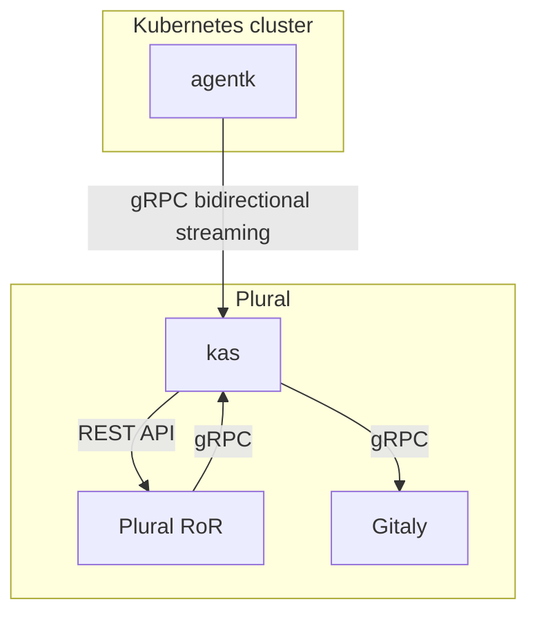

# Agent architecture

## Issues the agent is trying to address

- Integrate a cluster, located behind a firewall or NAT, with Plural. To
  learn more, read [issue #212810, Invert the model Plural.com uses for Kubernetes integration by leveraging long lived reverse tunnels](https://gitlab.com/gitlab-org/gitlab/-/issues/212810).
- Access API endpoints in a cluster in real time. For an example use case, read
  [issue #218220, Allow Prometheus in K8s cluster to be installed manually](https://gitlab.com/gitlab-org/gitlab/-/issues/218220#note_348729266).
- Enable real-time features by pushing information about events happening in a cluster.
  For example, you could build a cluster view dashboard to visualize changes in progress
  in a cluster. For more information about these efforts, read about the
  [Real-Time Working Group](https://about.gitlab.com/company/team/structure/working-groups/real-time/).
- Enable a [cache of Kubernetes objects through informers](https://github.com/kubernetes/client-go/blob/ccd5becdffb7fd8006e31341baaaacd14db2dcb7/tools/cache/shared_informer.go#L34-L183),
  kept up-to-date with very low latency. This cache helps you:

  - Reduce or eliminate information propagation latency by avoiding Kubernetes API calls
    and polling, and only fetching data from an up-to-date cache.
  - Lower the load placed on the Kubernetes API by removing polling.
  - Eliminate any rate-limiting errors by removing polling.
  - Simplify backend code by replacing polling code with cache access. While it's another
    API call, no polling is needed. This example describes [fetching cached data synchronously from the front end](https://gitlab.com/gitlab-org/gitlab/-/issues/217792#note_348582537) instead of fetching data from the Kubernetes API.

## High-level architecture

The Plural Agent and the Plural Agent Server use
[bidirectional streaming](https://grpc.io/docs/what-is-grpc/core-concepts/#bidirectional-streaming-rpc)
to allow the connection acceptor (the gRPC server, Plural Agent Server) to
act as a client. The connection acceptor sends requests as gRPC replies. The client-server
relationship is inverted because the connection must be initiated from inside the
Kubernetes cluster to bypass any firewall or NAT the cluster may be located behind.
To learn more about this inversion, read
[issue #212810](https://gitlab.com/gitlab-org/gitlab/-/issues/212810).

This diagram describes how Plural (`Plural RoR`), the Plural Agent (`agentk`), and the Plural Agent Server (`kas`) work together.

- `Plural RoR` is the main Plural application. It uses gRPC to talk to `kas`.
- `agentk` is the Plural Agent. It keeps a connection established to a
  `kas` instance, waiting for requests to process. It may also actively send information
  about things happening in the cluster.
- `kas` is the Plural Agent Server, and is responsible for:
  - Accepting requests from `agentk`.
  - [Authentication of requests](https://gitlab.com/gitlab-org/cluster-integration/gitlab-agent/-/blob/master/doc/identity_and_auth.md) from `agentk` by querying `Plural RoR`.
  - Fetching agent's configuration from a corresponding Git repository by querying Gitaly.
  - Matching incoming requests from `Plural RoR` with existing connections from
    the right `agentk`, forwarding requests to it and forwarding responses back.
  - (Optional) Sending notifications through ActionCable for events received from `agentk`.
  - Polling manifest repositories for [GitOps support](https://gitlab.com/gitlab-org/cluster-integration/gitlab-agent/-/blob/master/doc/gitops.md) by communicating with Gitaly.

<i class="fa fa-youtube-play youtube" aria-hidden="true"></i>
To learn more about how the repository is structured, see
[Plural Agent repository overview](https://www.youtube.com/watch?v=j8CyaCWroUY).

## Guiding principles

Plural prefers to add logic into `kas` rather than `agentk`. `agentk` should be kept
streamlined and small to minimize the need for upgrades. On Plural.com, `kas` is
managed by Plural, so upgrades and features can be added without requiring you
to upgrade `agentk` in your clusters.

`agentk` can't be viewed as a dumb reverse proxy because features are planned to be built
[on top of the cache with informers](https://github.com/kubernetes/client-go/blob/ccd5becdffb7fd8006e31341baaaacd14db2dcb7/tools/cache/shared_informer.go#L34-L183).

## FAQ

- **Q**: Why do we need long-running connections? Cannot we just ask users to punch a hole in their firewall?

  **A**: Even if it was always possible, having an agent running in the cluster enables us to build more features, not just connecting such clusters to Plural.

- **Q**: Why do we need long-running connections? Can we use polling instead?

  **A**: Polling will not allow for real-time access to the in-cluster APIs. For example, our metrics integration queries Prometheus API to get the data for dashboards. I.e. the request comes from Plural, not from the Kubernetes side.

- **Q**: Can we push data about things happening in the cluster using REST API instead of using streaming?

  **A**: Yes, we could use REST API and push the data. But since we already need long-running connections (see above), why not utilize them? `agentk` uses gRPC which [multiplexes multiple logical channels](https://www.cncf.io/blog/2018/08/31/grpc-on-http-2-engineering-a-robust-high-performance-protocol/) onto a usually smaller number of TCP connections. There will be a smaller number of TCP connections if all communications are consolidated and happen over gRPC. See the link for technical details.

- **Q**: Can we put the cache into `kas` rather than into `agentk` to make it "dumber" / simpler per the principle above?

  **A**: Technically yes. However, that would mean `kas` would get an update for each event for object kinds `kas` runs informers for. An event contains the whole changed object. Number of events in active clusters may be significant. So, multiplied by the number of clusters, that means we'd have a lot of traffic between `kas` and `agentk`. There is no practical benefit for building it this way, only the downside of having a lot of useless traffic.

  Instead of the above we could have an up to date precomputed view on top of the cache in `kas`. `agentk` could make the calculations locally and push an update immediately to `kas` (which could push an event via ActionCable). For example, `agentk` could maintain a cache with [`Node`](https://kubernetes.io/docs/concepts/architecture/nodes/) objects and push the current number of nodes to `kas` each time there is a change. The UI then can fetch the number of nodes from `kas` via an API (via the main application or bypassing it).

- **Q**: Why poll Git repositories from `kas` and not from `agentk`?

  **A**: There are several reasons:

  - Allows the Plural instance operator to configure polling frequency and any other relevant parameters. Makes it harder for the user to misuse/abuse the system.

  - Fewer knobs for the user to tweak means more straightforward configuration experience.

  - Makes it easier to implement pub/sub / push-based notifications about changes to the repo to reduce polling frequency.

  - It follows the "smart `kas`, dumb `agentk`" principle described above.
